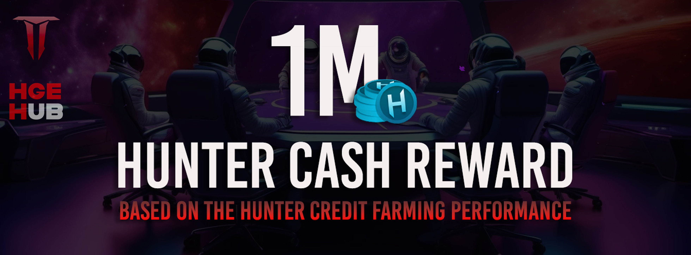

# Hunter Cash Token ($HCASH)

[Back to Index](../../../index.md)
## Summary of Our Economic Model

**$HCASH** is the primary project currency, designed to foster a sustainable and engaging gaming economy. Key aspects of its tokenomics include:

### Total Supply and Distribution
- **Total Supply**: Fixed at 1 billion tokens, strategically allocated over a 10-year period to support long-term economic stability.
- **Distribution Breakdown**:
  - **Game Modes**: 70% allocated to gaming rewards.
  - **Marketing Strategy**: 6.5% dedicated to marketing efforts.
  - **Token Pools Liquidity**: 3.5% reserved for liquidity pools.
  - **Ecosystem Innovation**: 15% set aside for future innovations within the ecosystem.
  - **Partners & Strategic Investors**: 5% allocated to partners and strategic investors.

### Dual Economy
- **Secondary Token ($HCREDIT)**: $HCREDIT is an auxiliary, utility-focused currency that facilitates smoother transactions for frequent or smaller-scale in-game activities, reducing reliance on $HCASH.
- **Community Engagement**: $HCREDIT drives community interaction by rewarding participation, offering players free entry to the games, and allowing them to progress and earn $HCASH.
- **Deflationary Model**: Every 45 days, all unspent $HCREDIT balances are burned, resetting the secondary economy to prevent oversupply. This motivates consistent participation and engagement, rewarding players actively involved in the ecosystem.
- **Recycling**: Fees collected from Fee-to-Play transactions contribute to currency recycling and periodic burns, preventing inflation and supporting the long-term value of both $HCASH and $HCREDIT.
- **F2P & P2E**: This hybrid model provides multiple progression pathways, ensuring both casual enjoyment and financial opportunities for dedicated players.

### $HCASH Tokenomics: Deflationary Model
$HCASH follows a structured deflationary model where the annual allocation decreases by 9%. In theory, up to 9% of the total supply (90 million $HCASH) could be minted each year for nine years if all game modes operate at full capacity, with the remaining tokens minted in the 10th year.

However, this isn’t a strict linear process. If certain game modes are underutilized or in development, less than 9% may be minted annually, enhancing $HCASH scarcity. In the first year, with gradual releases and development underway, fewer than 30 million $HCASH is expected to be minted, extending the supply timeframe and creating a strong economic foundation.

### Shared Experience
The ecosystem connects player profiles across all games, reflecting progress and achievements universally. This interconnectedness fosters community engagement, encourages active participation, and builds a shared experience across the entire gaming ecosystem.

## ✅ Social Media
Follow us on our social media

[Back to Index](../../../index.md)
