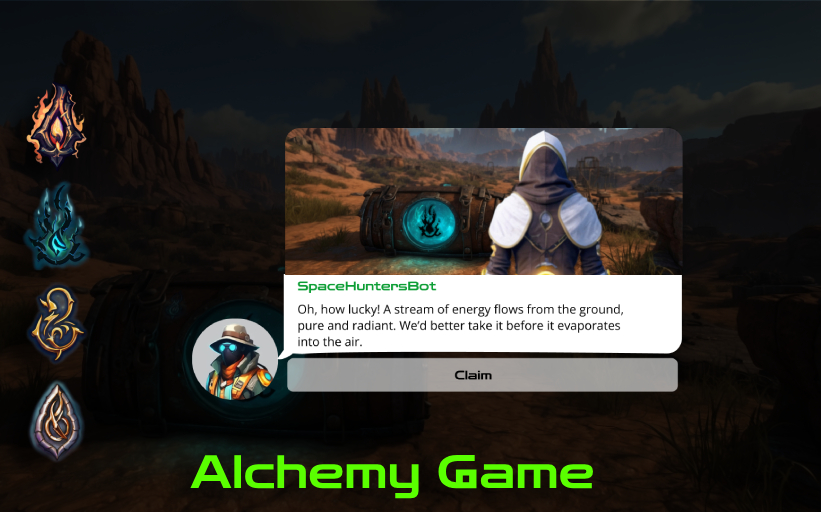
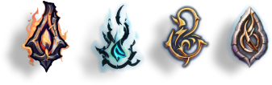
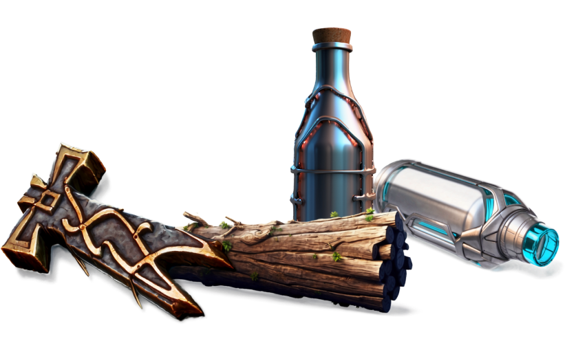

> Thi is the Engage to Earn v2.1

> Read the [Update 2.0 here](https://t.me/spacehuntersnews/124)

[Back to Index](../../../index.md)

## 💠 Alchemy Chat-Game 💠

# Game Guide

An immersive, chat-based world where players collect elements, craft powerful items, and compete with others. Climb the leaderboard, trade with others, and participate in events to become the ultimate player!

---

## **Index**
1. [Starting Out](#1-starting-out)
2. [Basic Gameplay Mechanics](#2-basic-gameplay-mechanics)
3. [Crafting System](#3-crafting-system)
4. [Trading and Marketplace](#4-trading-and-marketplace)
5. [Leveling Up and Leaderboards](#5-leveling-up-and-leaderboards)
6. [Events and Bonuses](#6-events-and-bonuses)
7. [Premium Features](#7-premium-features)
8. [In-Game Currency and Monetization](#8-in-game-currency-and-monetization)
9. [Strategies for Success](#9-strategies-for-success)

---

## 1. Starting Out
If you are new in the Hunter Gaming Ecosystem, upon opening [HUB App ](https://t.me/SpaceHuntersBot)  for the first time, you’ll be prompted to enter a username. This will be your in-game identity, so choose something memorable!

---

## 2. Basic Gameplay Mechanics

### **Element Drops**
- Elements appear randomly in the chat. Keep an eye out, as these are your primary resources for crafting items.
- The four base elements are:
  - **Aqua Nexus** – Pure water essence.
  - **Plasma Ember** – Raw fire spark.
  - **Voidstone** – Mysterious dark stone.
  - **Aero Mist** – Light air essence.

### **Collecting Elements**

- When an element drops in the chat, act quickly to claim it. Once claimed, it’s added to your inventory and can be used for crafting or trading.
- You can also find elements by participating in the chat, those elements will be find by you and sent to your inventory.

---

## 3. Crafting System

### **Elements and Recipes**
- Basic elements can be combined to create advanced elements and powerful runes.
- You can combine 2, 3, 4 and 5 elements to create a new one, the more elements you combine the more powerful and rare the new element will be.
- Combination attempts consume 1 $HCREDIT.

### **Runes and Potions**
- Runes are crafted using specific combinations of elements and provide various boosts or abilities.
- Crafting a rune may require several elements and a rare material, such as special wood or stone, to increase its power.
- To craft runes you need one of the three materials: **Yggdrasil Wood(1x stats)**, **Celestite Stone(3x stats)** or **Orichalcum Metal(10x stats)**. The recipe is the same but the quality and stats will be different based on the material used. 
- Potions use the same system like runes but with different materials (coming soon)

### **Using Crafting Stations**
- Access crafting stations in the app to view available recipes.
- Each recipe requires a certain combination of elements and sometimes a rare material.
- Successfully crafted items provide experience, which helps you level up and unlock new features.
- If you fail to  craft an item, all the ingredients will be lost.
- Rare materials cannot be found in the chat, they can be bought in the Marketplace or Game Store. You can also buy sometimes limited deals with a variety of ingredients and materials from Game Store.
- Common materials can be found in the chat by participating in the hourly exploration. This is a groupal activity where the more members join more chances to fin the materials.
- In some cases tools are required and can be crafted using the crafting station and material.
- Crafting attempts consume 10 $HCREDIT.

---

## 4. Trading and Marketplace

### **Marketplace**
- Use the marketplace to buy, sell, or trade elements and crafted items with other players.
- Each trade may have a small transaction fee, which helps maintain the marketplace balance.

### **Auctions**
- Rare items and powerful runes can be auctioned. Bid with in-game currency or tokens for a chance to win rare items.

---

## 5. Leveling Up and Leaderboards

### **Experience Points (EXP)**
- Gain EXP by collecting elements, crafting items, and participating in events.
- As you level up, new features, abilities, and rewards unlock.
- There are always secret achievements for active players.

### **Leaderboard**
- The leaderboard displays the top players based on points earned through collection, crafting, and trading.
- Weekly rewards are distributed to players on the leaderboard, encouraging active participation.
- Points are based on the elements, runes and potions hold, if you consume, sell or trade them, you will lose points.
- Weekly leaderboard will reward all the participants with a variety of rewards , including in-game currency, tokens, and exclusive items. The rewards will be decided depeneding the events, partners and the proyect progress.
- The leaderboard is updated every week, and the points will not reset to zero. You can keep increasing it every week.
---

## 6. Events and Bonuses

### **Daily and Weekly Events**
- Special events occur daily and weekly, offering increased drop rates for specific elements or rare items.
- Participate actively to earn exclusive rewards.

### **Bonuses**
- Bonuses are awarded for certain actions, such as collecting a specific number of elements in a day or crafting an advanced item.
- These bonuses can boost your chances of finding rare elements or increase your crafting success rate.

---

## 7. Premium Features

### **Subscription Pass**
- Purchase a monthly pass to access premium benefits:
  - Increased element drop rates.
  - Exclusive access and disscounts to superior elements and materials from store.
  - Reduced crafting fee to 1 HCREDIT.
  - Increased materials drop rate and chance.
  - 40% chance to trigger a claim multiplier up to 5x
  - 100% Combination or craft chances in the first 2 attempts (daily).
  - 25% chance to get an additional item when combining elements or crafting.
  - 25% chance to recover back one ingredient.

### **Boosters**
- Boosters can temporarily increase your element collection rate, crafting success, or EXP gain.

---

## 8. In-Game Currency and Monetization

### **In-Game Tokens & Monetization**
- $HCREDIT Tokens are earned by engaging with the game, social taskss etc,  and can be used for crafting, fees, or purchasing items and more.
- You can sell your superior elements to the NPC, in the marketplace or hold to participating in weekly rewards and events.
- More rare elements will be worth more $HCASH tokens, and you can sell them to the NPC or in the marketplace.
- All crafted Runes and Potions can be used in other games to boost, improve and earn more $HCASH, also enchanting equipments, tools and weapons increase their stats and give you more $HCASH tokens in result.
- $HCASH tokens can be used to buy exclusive items, boosters, and other premium features or just cashed out to your real money account.
- Initial launch price for $HCASH is $0.16 and will be adjusted based on the market and the proyect progress, with an expected circulation of less than 40M tokens in the next 12 months.

---

## 9. Strategies for Success

- **Collect Quickly**: Always keep an eye on the chat to grab elements as soon as they appear.
- **Plan Crafting**: Focus on crafting items that give you the highest EXP to level up quickly.
- **Trade Wisely**: Use the marketplace to exchange excess elements for those you need.
- **Engage in Events**: Participate actively in events for extra rewards and rare item opportunities.
- **Consider the Subscription**: If you’re serious about progressing, the monthly pass gives you valuable perks.
- **Keep an Eye on the Store**: Check the store regularly for new items and discounts.
- **Combine Elements**: Combine elements to get the best results and increase your chances of getting rare items
- **Participate in Social Tasks**: Participate in social tasks to earn free $HCREDIT tokens and other rewards.
- **Participate in the hourly expeditions**: Participating more continuoursly in the hourly expeditions will give you more chance to find resources and elements.
- **Do not share your reciped:** Sharing your reciped will give other players the chance to get the same items you have. Take notes to not forget the recipe and scale up in the leaderboard. Craft and combine that recipe and create business which benefits you!
- **Increasse results with conssumables:** Use consumables which helps to increase your chances of getting rare items and resources.
- **Do not spend blindly your rare materials:** Before attempt to discover a rune or potion, use a basic material, then you can try later with a rare material if you discovered the recipe using the basic material.

---

By mastering these mechanics, players can enjoy a rewarding experience filled with strategy, crafting, and competition. Start collecting, crafting, and climbing the ranks to become the ultimate alchemist!

## ✅ Social Media
Follow us on our social media

[Back to Index](../../../index.md)

