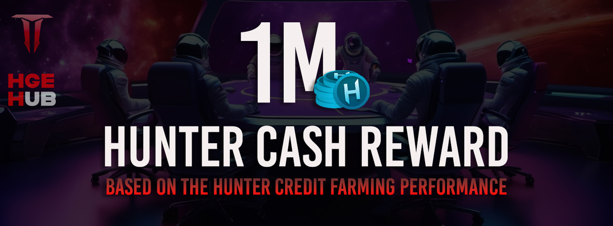

# Hunter Cash Token ($HCASH)

[Regresar al índice](../00-index.md)
## Resumen de Nuestro Modelo Económico

**$HCASH** es la moneda principal del proyecto, diseñada para fomentar una economía de juego sostenible y atractiva. Los aspectos clave de su tokenómica incluyen:

### Suministro Total y Distribución
- **Suministro Total**: Fijo en 1 mil millones de tokens, asignado estratégicamente durante un período de 10 años para apoyar la estabilidad económica a largo plazo.
- **Desglose de Distribución**:
  - **Modos de Juego**: 70% asignado a recompensas de juego.
  - **Estrategia de Marketing**: 6.5% dedicado a esfuerzos de marketing.
  - **Liquidez de Fondos de Tokens**: 3.5% reservado para los fondos de liquidez.
  - **Innovación del Ecosistema**: 15% reservado para futuras innovaciones dentro del ecosistema.
  - **Socios e Inversionistas Estratégicos**: 5% asignado a socios e inversionistas estratégicos.

### Economía Dual
- **Token Secundario ($HCREDIT)**: $HCREDIT es una moneda auxiliar enfocada en la utilidad que facilita transacciones más suaves para actividades frecuentes o de menor escala en el juego, reduciendo la dependencia de $HCASH.
- **Compromiso Comunitario**: $HCREDIT impulsa la interacción comunitaria al recompensar la participación, ofreciendo a los jugadores entrada gratuita a los juegos y permitiéndoles progresar y ganar $HCASH.
- **Modelo Deflacionario**: Cada 45 días, todos los saldos no utilizados de $HCREDIT se queman, reiniciando la economía secundaria para prevenir el exceso de suministro. Esto motiva la participación constante y el compromiso, recompensando a los jugadores activos en el ecosistema.
- **Reciclaje**: Las tarifas recaudadas de las transacciones Fee-to-Play contribuyen al reciclaje de moneda y quemas periódicas, previniendo la inflación y apoyando el valor a largo plazo de ambos tokens, $HCASH y $HCREDIT.
- **F2P & P2E**: Este modelo híbrido ofrece múltiples vías de progresión, asegurando tanto el disfrute casual como oportunidades financieras para los jugadores dedicados.

### Tokenómica de $HCASH: Modelo Deflacionario
$HCASH sigue un modelo deflacionario estructurado donde la asignación anual disminuye un 9%. En teoría, hasta un 9% del suministro total (90 millones de $HCASH) podría ser minado cada año durante nueve años si todos los modos de juego operan a plena capacidad, con los tokens restantes minados en el décimo año.

Sin embargo, esto no es un proceso estrictamente lineal. Si ciertos modos de juego están infrautilizados o en desarrollo, se puede minar menos del 9% anualmente, aumentando la escasez de $HCASH. En el primer año, con lanzamientos graduales y desarrollo en curso, se espera que se mine menos de 30 millones de $HCASH, extendiendo el suministro y creando una sólida base económica.

### Experiencia Compartida
El ecosistema conecta los perfiles de los jugadores en todos los juegos, reflejando el progreso y logros de forma universal. Esta interconexión fomenta el compromiso comunitario, anima la participación activa y construye una experiencia compartida en todo el ecosistema de juegos.

## ✅ Redes Sociales
Síguenos en nuestras redes sociales

[Regresar al índice](../00-index.md)